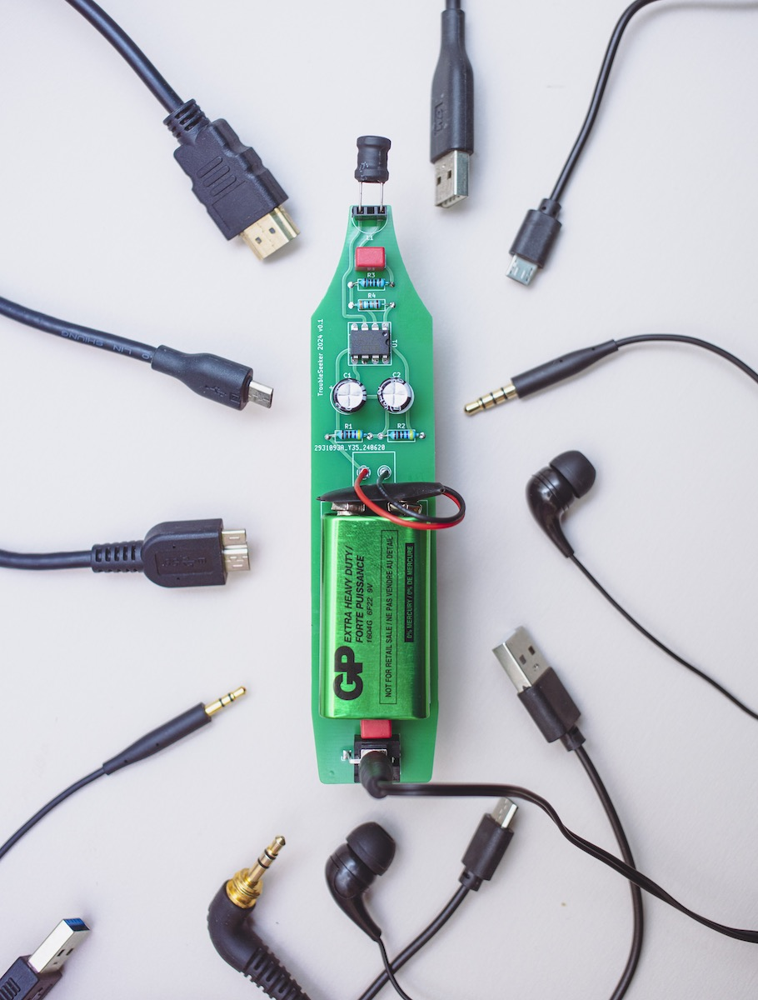

# TroubleSeeker
Electromagnetic Radiation detector, based on the [Elektrosluch 3 by LOM Audio](https://store.lom.audio/products/elektrosluch-3?variant=4542168268832) re-designed for workshops (cost optimisation and ease of soldering). Perfboard variant can be found [here](https://makezine.com/projects/weekend-project-sample-weird-sounds-electromagnetic-fields)

Component values are non crucial.

Assembly tutorial [here](https://youtu.be/3JtvDqBiOzs)

First debuted at the TroubleMaker Shenzhen Reboot June 2024 Huaqiangbei.
